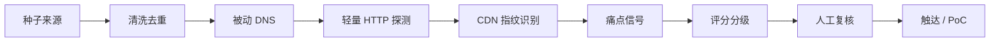

# CDN Lead Miner

面向 **海外 CDN、技术兼商务、零销售编制** 团队的线索挖掘工具与流程说明。

只做 **公开信息** 的被动/轻量主动探测（DNS + 首页 HTTP），用于发现「可能有 CDN 痛点」的合规中小企业，不用于骚扰式爬取或灰产拓客。

## 文档

项目中所有 **查询、探测、筛选** 用法已整理至 [`docs/`](docs/README.md)：

| 文档 | 内容 |
|------|------|
| [查询总览](docs/queries/overview.md) | 全流程数据流与字段说明 |
| [种子来源查询](docs/queries/seed-sources.md) | Tranco、crt.sh、行业目录 |
| [DNS 查询](docs/queries/dns-queries.md) | CNAME 链、A 记录 |
| [HTTP 探测](docs/queries/http-probes.md) | 首页 TTFB、响应头 |
| [CDN 指纹库](docs/queries/cdn-fingerprints.md) | DNS/HTTP 完整对照表 |
| [评分规则](docs/queries/scoring-rules.md) | hot/warm/cool 分级 |
| [线索筛选查询](docs/queries/lead-filters.md) | CSV/jq 筛选示例 |
| [CLI 命令参考](docs/cli-reference.md) | 全部子命令 |
| [工作流与触达](docs/workflow.md) | 周循环、合规、邮件模板 |

## 流程总览



| 阶段 | 做什么 | 工具 |
|------|--------|------|
| 1. 种子 | 收集域名列表 | Tranco、crt.sh、行业目录、社群手动录入 |
| 2. 清洗 | 去重、TLD 过滤、去掉政府/教育 | `seeds.filter_domains` |
| 3. 被动侦察 | CNAME 链、A 记录 | `dnspython` |
| 4. 主动探测 | 首页 GET、TTFB、响应头 | `aiohttp`（仅 `/`，不深度爬） |
| 5. 指纹 | 识别 Cloudflare/Akamai/无 CDN 等 | `cdn_fingerprints.py` |
| 6. 评分 | hot/warm/cool/low | `scoring.py` |
| 7.  enrichment | 公司名、邮箱、社交 | 人工 + Hunter/Snov（可选） |
| 8. 触达 | 技术向 PoC 邀请 | 邮件/Telegram/社群 |

## 快速开始

```bash
pip install -r requirements.txt

# 1) 从 Tranco 拉种子（list_id 见 https://tranco-list.eu/）
python -m leadminer.cli fetch-tranco L5VX9 -n 1000 -o data/seeds/tranco.csv

# 2) 探测并评分
python -m leadminer.cli run data/seeds/example.csv -o data/leads/leads.csv --min-tier warm

# 3) 查看结果（按 score 降序）
column -s, -t < data/leads/leads.csv | head
```

## 种子来源（按性价比）

### A. 流量榜单（广撒网）

- **Tranco**：稳定、可复现，适合「有流量的站」
- **Cloudflare Radar Top Domains**（需注册 API）：按国家/行业筛

```bash
python -m leadminer.cli fetch-tranco <LIST_ID> -n 5000 -o data/seeds/tranco.csv
```

### B. 证书透明度（找新站、出海站）

```bash
# 示例：最近 7 天含 shop 关键词的证书（注意速率限制）
curl -s 'https://crt.sh/?q=%.shop&output=json' | jq -r '.[].name_value' | sort -u | head -500 > data/seeds/shop.txt
```

适合：独立站、跨境电商、新上线产品。

### C. 垂直行业目录（精准）

手动或脚本整理为 CSV（`domain,tranco_rank,source`）：

| 行业 | 去哪找 |
|------|--------|
| 独立站 | Shopify 公开案例、Product Hunt、Indie Hackers |
| 游戏 | itch.io、Steam 开发商站、Discord 游戏社群 |
| SaaS | G2/Capterra 小厂商官网 |
| 直播/视频 | 合规直播平台上的主播独立站 |

### D. 竞品客户（切换机会）

对本工具输出的 `cdn_vendors` 列做筛选：

- `Cloudflare` / `AWS CloudFront` + `slow_ttfb` → 价格或服务痛点
- `no_cdn_detected` + 高 `asset_count_hint` → 静态加速需求
- 某区域慢（需多地探测，见下文扩展）

## CDN 识别原理

本工具合并 **DNS CNAME** 与 **HTTP 响应头** 两套指纹：

| 厂商 | DNS 特征 | HTTP 特征 |
|------|----------|-----------|
| Cloudflare | `*.cloudflare.net` | `cf-ray`, `server: cloudflare` |
| AWS CloudFront | `*.cloudfront.net` | `x-amz-cf-id`, `x-cache: cloudfront` |
| Fastly | `*.fastly.net` | `x-served-by: cache-`, `x-fastly-request-id` |
| Akamai | `*.akamaiedge.net` | `x-akamai-*` |
| BunnyCDN | `*.b-cdn.net` | `x-bunny-*` |

完整列表见 `leadminer/cdn_fingerprints.py`。

### 第三方商业数据（可选）

| 服务 | 用途 | 备注 |
|------|------|------|
| [BuiltWith](https://builtwith.com/) | 技术栈 + CDN | 付费 API，适合批量 |
| [Wappalyzer](https://www.wappalyzer.com/) | 技术栈 | 有 API |
| [SecurityTrails](https://securitytrails.com/) | 历史 DNS | 看是否刚换 CDN |
| [IPinfo](https://ipinfo.io/) | IP → ASN | 辅助判断机房 |

自建探测适合 **低成本日更**；商业 API 适合 ** enrichment 阶段** 而非全量扫描。

## 评分逻辑（可改）

默认规则见 `leadminer/scoring.py`：

| 信号 | 分值 | 含义 |
|------|------|------|
| Tranco 排名前 1 万 | +25 | 有流量 |
| 未检测到 CDN | +20 | 增量市场 |
| 使用大厂 CDN | +12 | 可谈迁移/副线路 |
| TTFB ≥ 800ms | +15 | 性能痛点 |
| 第三方静态资源多 | +10 | 适合 CDN |
| 未 HTTPS | +5 | 基础架构待优化 |

分级：`hot` ≥45，`warm` ≥28，`cool` ≥15。

**技术兼商务** 建议每周只跟进 `hot` + 前 20 条 `warm`，避免被低质量线索拖垮。

## 合规与边界（必读）

1. **只探测首页** `/`，遵守 `robots.txt` 精神；不扫路径、不爆破。
2. **速率限制**：默认并发 20，对单域名不要 repeated 探测。
3. **User-Agent** 标明身份与联系邮箱：`--user-agent "LeadMiner/0.1 (+mailto:you@corp.com)"`。
4. **数据最小化**：只存域名、CDN、延迟等 B2B 公开技术事实；不爬个人隐私。
5. **触达合规**：邮件需退订；欧盟注意 GDPR；中国境外客户注意 CAN-SPAM 等。
6. **用途限制**：不用于灰产、钓鱼、未授权渗透；发现违法站点应放弃而非转化。

## 推荐周循环（零销售编制）

```
周一  更新 Tranco 种子 5000 → 跑 pipeline → 导出 warm+
周二  按 cdn_vendors / tier 分组，人工筛 30 个
周三  BuiltWith/Hunter 补 10 个公司的技术联系人
周四  发 10 封技术向邮件 / Telegram（附 PoC 方案）
周五  跟进 2 个 PoC，把结果写成案例片段
```

## 扩展：多地延迟（海外节点卖点）

从 **你节点所在地区** 发起探测只能反映单点视角。要证明「你的 CDN 更快」，建议：

1. 在东南亚/美西/欧洲各放一台 **探测 VPS**（与业务节点同区域）。
2. 每台跑同一 `leads.csv`，合并 `ttfb_ms` 列。
3. 若 `竞品 CDN 在 A 地快、在你目标地慢` → 提高 `target_regions_slow` 评分。

可用 [GlobalPing](https://www.jsdelivr.com/network/globalping) 或自建 `probe.sh` + cron。

## 扩展：与 CRM 对接

导出 CSV 后导入：

- **Notion / Airtable**：免费够用
- **HubSpot Free**：带邮件序列
- 字段建议：`domain`, `tier`, `cdn_vendors`, `ttfb_ms`, `contact_email`, `status`, `next_followup`

## 项目结构

```
leadminer/
  cdn_fingerprints.py   # CDN 指纹库
  dns_lookup.py         # CNAME / A 记录
  http_probe.py         # 首页探测
  scoring.py            # 线索评分
  pipeline.py           # 流水线
  seeds.py              # Tranco 种子
  cli.py                # 命令行
data/
  seeds/                # 输入域名
  leads/                # 输出线索
```

## 触达模板（技术向，简短）

主题：`PoC offer: CDN latency check for {{domain}}`

正文要点：

- 我们注意到 `{{domain}}` 当前使用 `{{cdn_vendors}}`，首页 TTFB 约 `{{ttfb_ms}}`ms。
- 我们运营海外自营节点，可提供 **14 天免费并行 PoC**（不改主站，仅子域名测试）。
- 附迁移 checklist 与对比方法，无需销售电话。

---

如需增加指纹、改评分权重、或接 BuiltWith API，直接改 `cdn_fingerprints.py` / `scoring.py` 即可。
