# 查询总览

本文描述 CDN Lead Miner 中所有查询的串联关系与输入输出格式。

## 数据流

```mermaid
flowchart TB
  subgraph seeds [种子获取]
    T[Tranco API]
    C[crt.sh 证书查询]
    M[手动 CSV/TXT]
  end

  subgraph passive [被动查询]
    DNS_C[CNAME 链查询]
    DNS_A[A 记录查询]
  end

  subgraph active [轻量主动探测]
    HTTP[首页 HTTPS/HTTP GET]
    HDR[响应头采集]
    TTFB[TTFB 测量]
    ASSET[第三方静态资源计数]
  end

  subgraph detect [识别与评分]
    FP[CDN 指纹匹配]
    SC[线索评分]
  end

  subgraph output [输出与筛选]
    CSV[leads.csv]
    FILT[按 tier/cdn 筛选]
  end

  T --> M
  C --> M
  M --> DNS_C
  M --> DNS_A
  DNS_C --> FP
  DNS_A --> FP
  M --> HTTP
  HTTP --> HDR
  HTTP --> TTFB
  HTTP --> ASSET
  HDR --> FP
  FP --> SC
  TTFB --> SC
  ASSET --> SC
  SC --> CSV
  CSV --> FILT
```



## 查询阶段一览

| 阶段 | 查询类型 | 协议/工具 | 默认超时 | 输出字段 |
|------|----------|-----------|----------|----------|
| 1 | Tranco Top 列表 | HTTPS GET | — | `domain`, `tranco_rank`, `source` |
| 2 | crt.sh 证书 | HTTPS GET + jq | — | 纯文本域名列表 |
| 3 | CNAME 链 | DNS UDP/TCP | 5s | `cname_chain`, DNS CDN 匹配 |
| 4 | A 记录 | DNS UDP/TCP | 5s | `a_records` |
| 5 | 首页探测 | HTTPS/HTTP GET | 10s | `status`, `ttfb_ms`, `headers` |
| 6 | CDN 指纹 | 规则匹配 | — | `cdn_vendors`, `cdn_evidence` |
| 7 | 评分 | 启发式 | — | `score`, `tier`, `score_reasons` |

## 种子输入格式

### CSV（推荐）

```csv
domain,tranco_rank,source
example.com,1000,manual
shop.example.io,,crt.sh:shop
```

支持列名：`domain` 或 `host`；`tranco_rank` 或 `rank`。

### 纯文本

每行一个域名，`#` 开头为注释：

```
example.com
# 手动添加的测试域
nginx.org
```

## 线索输出格式

`data/leads/leads.csv` 主要列：

| 列名 | 说明 |
|------|------|
| `domain` | 域名 |
| `tier` | `hot` / `warm` / `cool` / `low` / `skip` |
| `score` | 综合分值 |
| `tranco_rank` | Tranco 排名（若有） |
| `cdn_vendors` | 检测到的 CDN，`\|` 分隔 |
| `ttfb_ms` | 首字节时间（毫秒） |
| `asset_count_hint` | 首页第三方静态资源数量 |
| `uses_https` | 是否最终走 HTTPS |
| `cname_chain` | CNAME 链，`\|` 分隔 |
| `score_reasons` | 评分依据，`\|` 分隔 |

## 并发与限速

- 默认并发：**20**（`--concurrency`）
- 单域名：先 DNS，再 HTTP；HTTP 仅请求首页 `/`
- 不可达域名：`tier=skip`，`score=0`

详见 [CLI 命令参考](../cli-reference.md)。
