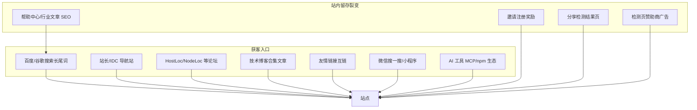

# 竞品网站曝光渠道分析

> 分析对象：vsping.com、cesu.ai、boce.com、itdog.cn  
> 目的：梳理同类测速/拨测工具站的线上曝光位置，为 speedce.com 推广提供参考  
> 整理时间：2026-06-21

---

## 一、赛道定位

这四个网站均属于 **站长/运维向网络拨测工具平台**，核心功能高度重叠：

- 网站测速（HTTP/HTTPS）
- 在线 Ping / TCPing
- DNS 查询 / 污染检测
- 域名被墙 / 劫持 / QQ·微信拦截检测
- ICP 备案查询、Whois、SSL 检测、路由追踪等

它们的流量并不主要靠传统广告投放，而是靠以下渠道叠加：

**SEO 长尾词 + 导航收录 + 社区口碑 + 友情链接互推 + 检测结果页裂变 + 微信/API 生态**

---

## 二、共同曝光渠道

| 渠道类型 | 具体位置 | 如何搜索到这些网站 |
|---------|---------|-------------------|
| **搜索引擎** | 百度/谷歌搜「网站测速」「在线 ping」「dns 查询」「域名被墙检测」等 | 直接搜关键词，或 `site:itdog.cn` |
| **站长/IDC 导航站** | IDC 导航、芦虎导航、霂明导航、桃子百科、itotii 导航等 | 搜「ITDOG 导航」「拨测 导航」「站长工具导航」 |
| **技术博客合集** | 《12 个好用测速工具》类文章 | 搜「在线 ping 工具推荐」「网站测速工具分享」 |
| **VPS/主机论坛** | HostLoc、NodeLoc 等 | 搜 `hostloc 测速` 或 `hostloc itdog` |
| **友情链接互链** | 页脚「友情链接」：DNS 商、VPS 测评站、域名注册商、SEO 工具 | 查看各站底部友链列表 |
| **站内 SEO 内容** | 帮助中心、行业知识、公告、新闻资讯 | 各站 `/help`、`/article`、`/news` |
| **用户裂变** | 邀请注册送「波点/V 点/检测点」；分享检测结果带邀请参数 | 各站帮助文档里的「网站推广」说明 |
| **检测页赞助商** | 测速结果页「赞助商」文字链（付费） | vsping、itdog 公告里有定价 |
| **爱站/站长工具** | 被当作案例收录在 SEO 查询平台 | 爱站网搜 `itdog.cn`、`boce.com` |

---

## 三、各站单独分析

### 3.1 ITDOG（itdog.cn）— 社区口碑最强

**官网：** https://www.itdog.cn  
**运营主体：** 四川云邦畅想科技有限公司

#### 主要曝光来源

1. **HostLoc 全球主机交流论坛**
   - 有专门讨论帖，ITDOG 站长写过回应文：[ITDOG 在同类工具网站中最受用户欢迎？](https://www.itdog.cn/article/content-295.html)
   - 原帖：https://hostloc.com/thread-936694-1-1.html
   - HostLoc 页脚友链里有「**IT狗**」

2. **导航站收录**
   - [IDC 导航](https://www.idc.ke/97)
   - [芦虎导航](https://www.luhu.co/site/000000000010554.shtml)
   - [霂明导航](https://n.mumingfang.com/operate)（站长工具分类）
   - [桃子百科](https://www.tzbke.com/sites/106.html)（相关导航里并列 boce）

3. **技术博客推荐**
   - [奇妙的 Linux 世界](https://www.hi-linux.com/posts/29415.html)
   - [VPS 测评网](https://www.vpsvs.com/post/3746)
   - [HostLoc 5 个推荐 ping 工具帖](https://hostloc.com/thread-1423655-1-1.html)

4. **站内内容运营**
   - 网络杂烩、帮助中心、公告（`/article/`）
   - 自报月使用量超 **900 万次**（2023 年数据）

5. **Chrome 全球热门网站榜**
   - 自称排名约 **#327547**（全球百万站内）

6. **赞助商广告位**
   - 检测节点文字广告，用于覆盖节点成本

7. **流量特征**
   - 爱站/站长工具显示：**直接访问占比高**（约 70%）
   - 百度收录量不高，更依赖口碑和书签，而非 SEO 堆砌

#### 推广机制

- 检测页赞助商文字广告（回笼节点成本）
- 家庭宽带拨测节点招募（50–150 元/节点/月）

---

### 3.2 BOCE 拨测（boce.com）— 商业化与生态最全

**官网：** https://www.boce.com  
**运营主体：** 厦门帝恩思科技股份有限公司（新三板 837018）旗下

#### 主要曝光来源

1. **母公司帝恩思生态**
   - 关联 [51DNS.COM](https://www.51dns.com)
   - 友链覆盖：聚名网、易名科技、美橙互联、桔子 SEO、主机测评站等

2. **微信生态**
   - **微信小程序**（站内扫码进入）
   - **微信公众号**
   - 支持微信一键登录/注册

3. **AI 开发者生态（差异化明显）**
   - [MCP 服务](https://www.boce.com/mcp.html)：`https://mcp.boce.com/sse`
   - 适配 Cursor、VS Code、Claude Code、Trae、Windsurf 等
   - [Skill 扩展](https://www.boce.com/skill.html)：npm 包 `@boce/skill-network-diagnostic`
   - 在 AI 工具配置文档、npm 里可被搜到

4. **导航/百科收录**
   - [桃子百科](https://www.tzbke.com/sites/106.html)
   - [芦虎导航](https://www.luhu.co/site/000000000010554.shtml)（与 ITDOG 同页）
   - [IID.HK 工具合集](https://www.iid.hk/en/help/57.html)

5. **论坛/博客**
   - HostLoc 推荐帖常与 ITDOG、17CE 并列
   - NodeLoc 横向测评帖

6. **SEO 内容矩阵**
   - **行业知识**几乎日更（DNS、SSL、SSH 等长尾词）
   - 帮助中心、公告、热门标签/专题

7. **商业触点**
   - 客服热线：400-008-0908
   - 商务 QQ：3953378523
   - 商务邮箱：sales@boce.com
   - VIP 会员、波点充值、广告位招商

8. **友链网络（示例）**
   - VPS 小学生、主机测评网、垦派科技、260 站长社区、菠萝云、畅行云 CDN 等

#### 推广机制

- 邀请注册送波点（普通用户 1000，VIP 2000）
- 被邀请人充值返波点
- 检测结果页分享带邀请链接
- 每日登录连续签到奖励

---

### 3.3 VSPING（vsping.com）— 功能全，外部收录偏弱

**官网：** https://www.vsping.com  
**运营主体：** 成都游贝网络有限公司（页脚 ICP：蜀 ICP 备 2020035255 号-3）

#### 主要曝光来源

1. **站内 SEO**
   - 帮助中心、新闻资讯
   - 工具页覆盖：测速、ping、被墙、污染、QQ/微信拦截等长尾词

2. **邀请裂变**
   - 「网站推广」：邀请新用户注册及充值，赚取 V 点奖励

3. **赞助商广告**
   - 检测页广告位：**300 元/条/季度**
   - 联系 QQ：2486873671
   - 展示位置：网站测速、ping 检测、TCPing 检测、劫持检测结果等

4. **友链**
   - 页脚有友链区，但外部导航/论坛曝光明显少于 ITDOG、BOCE

5. **对外联系**
   - 邮箱：mail@vsping.com
   - 广告/API 需求 QQ：2486873671

#### 相对弱点

- 第三方导航站、论坛推荐较少
- 更依赖自有 SEO + 邀请裂变 + 检测页广告

---

### 3.4 CESU（cesu.ai）— 新站，SEO 在跑，外链很少

**官网：** https://www.cesu.ai

#### 主要曝光来源

1. **站内 SEO 文章**
   - 如「网站测速在线测试哪个好」「网站速度检测工具哪个好」
   - 通过对比文抢长尾词

2. **邀请裂变**
   - 邀请注册得 1000 检测点
   - 被邀请人充值返 5% 检测点

3. **友链（与 boce/同类站高度重叠）**
   - 域名解析、91HTTP、洁哥教育、网站安全防护、测速网、易云主机测评、免费智能 DNS 等

4. **客服渠道**
   - cesu.ai.kefu@gmail.com
   - WhatsApp

#### SEO 数据（爱站，2026 年参考）

- 百度收录约 **0**
- 百度来路 IP 个位数
- 说明主要靠新域名 + 内容更新，尚未形成外链和口碑

#### 相对弱点

- 外部导航/论坛曝光明显不足
- 友链数量少，外链几乎为 0

---

## 四、曝光渠道层级图



---

## 五、竞品对比总结

| 网站 | 最强曝光渠道 | 相对弱点 |
|------|-------------|---------|
| **itdog.cn** | HostLoc 口碑 + 导航收录 + 技术博客 | 百度 SEO 收录不高 |
| **boce.com** | 帝恩思生态 + 微信 + AI/MCP + 日更 SEO | 商业化重，免费额度有限 |
| **vsping.com** | 站内 SEO + 邀请裂变 + 检测页广告 | 第三方导航/论坛曝光少 |
| **cesu.ai** | 站内对比文 SEO | 外链几乎为 0，站点较新 |

---

## 六、speedce.com 推广行动清单

### 第一优先级（成本低、见效快）

1. **提交站长/IDC 导航收录**

   | 导航站 | 链接 |
   |--------|------|
   | IDC 导航 | https://www.idc.ke/ |
   | 芦虎导航 | https://www.luhu.co/ |
   | 霂明导航 | https://n.mumingfang.com/ |
   | 桃子百科 | https://www.tzbke.com/ |
   | itotii 导航 | https://nav.itotii.com/ |

   可继续搜「站长工具导航 申请收录」找到更多入口。

2. **做 SEO 长尾内容**（参考 boce/itdog）
   - 帮助中心：「在线 ping 怎么用」「DNS 污染是什么」
   - 对比文：「网站测速工具哪个好」（自然带入 speedce）
   - 目标词：网站测速、在线 ping、tcping、dns 查询、域名被墙检测

3. **友情链接交换**
   - 目标站点类型：DNS 解析商、VPS 测评站、域名商、SSL 证书商
   - 参考 boce 友链列表逐一联系

4. **用户邀请裂变**
   - 检测结果页分享带邀请码
   - 注册/充值返「检测点」类积分

### 第二优先级（建立口碑）

5. **社区软推广**
   - [HostLoc](https://hostloc.com/)：发测评帖、参与「ping 工具推荐」讨论
   - [NodeLoc](https://www.nodeloc.com/)
   - 避免硬广，用「横向测评」「新工具体验」形式

6. **争取被博客合集收录**
   - 联系 [VPS 测评网](https://www.vpsvs.com/)、[hi-linux.com](https://www.hi-linux.com/) 等作者
   - 提供可引用的工具介绍页

7. **检测页赞助商模式（可选）**
   - 在 itdog/vsping 的赞助商广告位投放 speedce（若预算允许）

### 第三优先级（差异化、中长期）

8. **微信生态**
   - 开发小程序（参考 boce）：方便站长手机测速
   - 公众号发工具教程

9. **API / MCP 接入 AI 生态**（boce 最新方向）
   - 提供 API 文档
   - 做 MCP Server，让 Cursor 等 AI 工具能调用 speedce
   - 在 npm、GitHub、MCP 配置文档里留下曝光

10. **搜索引擎站长平台**
    - 百度搜索资源平台 / Google Search Console
    - 提交 sitemap、主动推送 URL

---

## 七、竞品监控搜索指令

用于持续追踪同类网站出现在网络的哪些位置：

```text
# 导航收录
"speedce.com" OR "itdog" site:idc.ke OR site:luhu.co OR site:tzbke.com

# 论坛讨论
itdog OR boce OR vsping site:hostloc.com

# 博客推荐
"网站测速" "在线ping" 推荐 工具

# 友链来源
link:itdog.cn
link:boce.com

# 微信生态
拨测 小程序
```

---

## 八、核心结论

这个赛道的真实流量入口不是抖音或信息流，而是：

> **站长搜工具 → 导航/论坛/博客点进来 → 书签收藏 → 分享给同事**

对 speedce.com 而言，建议优先投入：

1. 导航站收录
2. 长尾 SEO 文章
3. HostLoc 等社区存在感
4. 友链交换

有余力后再跟进微信小程序和 MCP/API 生态（boce 近一年的新增长点）。

### 配套实操文档

- [speedce 导航站申请清单](./speedce-导航站申请清单.md) — 可申请的导航站、申请入口、友链要求与执行顺序
- [speedce HostLoc 与 SEO 内容提纲](./speedce-HostLoc与SEO内容提纲.md) — HostLoc 发帖模板、站内 SEO 文章大纲与发布日历

---

## 附录：参考链接

### 竞品官网

- https://www.vsping.com
- https://www.cesu.ai
- https://www.boce.com
- https://www.itdog.cn

### 论坛与社区

- https://hostloc.com/
- https://www.nodeloc.com/

### 技术博客（合集推荐类）

- https://www.hi-linux.com/posts/29415.html
- https://www.vpsvs.com/post/3746
- https://hostloc.com/thread-1423655-1-1.html

### BOCE AI 生态

- https://www.boce.com/mcp.html
- https://www.boce.com/skill.html
- https://mcp.boce.com/sse
